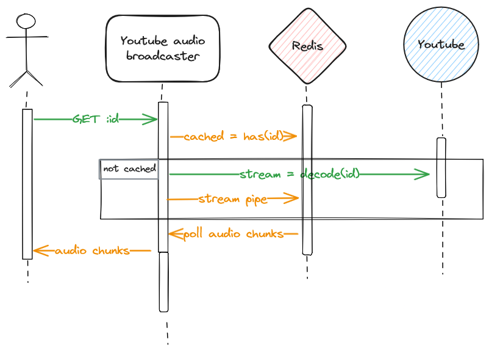

 # Youtube audio broadcaster
 
This project stems from the need to broadcast audio from a single source to multiple clients at the same time.
This is useful for example when you want to listen to music with friends.

## How it works

Using simple solution such as [ytdl](https://github.com/distubejs/ytdl-core) will eventually lead 
to a "Too Many Requests" error from Youtube.

To circumvent this, a caching layer is used to temporary store the audio data. 
This way, the audio data is only downloaded once and can be served to multiple clients.

As multiple requests for the same audio data can be made at nearly the same time, 
the audio is transcoded and cached asynchronously. As a result, the audio can be played back
even if the transcoding is not yet finished.



## Configuration

The configuration is done using environment variables.


| Variable                  | Description                               | Default                    |
|---------------------------|-------------------------------------------|----------------------------|
| `APP_PORT`                | The port the server listens on            | `3000`                     |
| `REDIS_CONNECTION_STRING` | The Connection string of the Redis server | `'redis://localhost:6379'` |
| `AUDIO_FORMAT`            | The audio format to transcode to          | `mp3`                      |
| `AUDIO_BITRATE`           | The audio bitrate to transcode to         | `128k`                     |
| `AUDIO_EXPIRE`            | The time in seconds the audio is cached   | `4 * 3600`                 |

## Usage

To start the server, simply run `npm start`.

To start streaming the Youtube video audio, make a `GET` request to either `/download/mp3/:id` or `/stream/:id`
(both works for backward compatibility reasons) with the `id` query parameter set to the Youtube video ID.

```bash
curl http://localhost:3000/download/mp3/VIDEO_ID
```

The first call will trigger the download and transcoding of the audio. 
The other calls will return the cached audio as its being processed.

